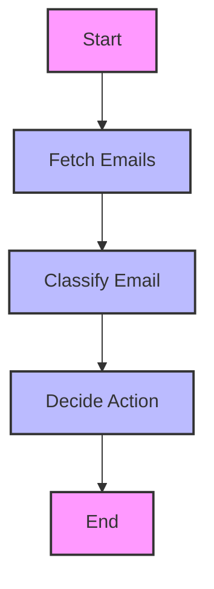

# AI_AGENTS

## Email Processing Agent

An intelligent agentic system that automatically processes your Gmail inbox using LangChain and LangGraph for workflow orchestration.

---

## Architecture

The workflow is orchestrated using LangGraph and consists of the following steps:



---

## Features

- **Email Fetching**: Connects to Gmail API to retrieve emails.
- **Classification**: Automatically categorizes emails (promotions, important, etc.).
- **Action Decision**: Determines appropriate actions (delete, draft reply, archive).
- **Drafting Replies**: Keeps a draft of important emails that require a response.
- **Workflow Management**: Uses LangGraph for orchestrating the email processing pipeline.
- **Cloud Deployment**: Terraform scripts for AWS Lambda and ECR integration.

---

## System Requirements

- Python 3.12+
- Gmail API credentials
- OpenAI API key (for LLM-based classification)
- Required packages listed in `requirements.txt`
- AWS credentials (for cloud deployment)

---

## Installation

1. **Clone the repository:**
    ```bash
    git clone https://github.com/yourusername/AI_AGENTS.git
    cd AI_AGENTS
    ```

2. **Create and activate virtual environment:**
    ```bash
    python -m venv agents
    .\agents\Scripts\activate
    ```

3. **Install dependencies:**
    ```bash
    pip install -r email_agent/src/requirements.txt
    ```

4. **Configure Gmail credentials:**
    - Create a project in Google Cloud Console
    - Enable Gmail API
    - Download credentials and save as `credentials.json` in the appropriate location

5. **Set environment variables:**
    - Copy `.env.example` to `.env` and fill in your secrets

---

## Project Structure

```
email_agent/
├── src/
│   ├── graph.py          # LangGraph workflow definition
│   ├── state.py          # State management
│   ├── main.py           # Application entry point
│   └── nodes/            # Workflow nodes
│       ├── fetch_emails.py
│       ├── classify_email.py
│       └── decide_action.py
├── terraform/            # Infrastructure as Code for AWS Lambda/ECR
```

---

## Usage

1. **Run the email processing agent:**
    ```bash
    python email_agent/src/main.py
    ```

2. **Visualize the workflow graph:**

    The workflow graph can be visualized using LangGraph’s built-in Mermaid PNG rendering:

    ```python
    # Example usage in Python
    from graph import build_graph

    chat_graph = build_graph()
    chat_graph.get_graph().draw_mermaid_png()
    ```

    This will generate a PNG image of the workflow graph similar to the Mermaid diagram above.

---

 __start__
     |
     v
 fetch_emails
     |
     v
 classify_email
     |
     v
 decide_action
     |
     v
  __end__


## Cloud Deployment

- Infrastructure is managed via Terraform scripts in the `terraform/` directory.
- Update `terraform.tfvars` with your AWS region, API keys, and Docker image details.
- Deploy using:
    ```bash
    cd email_agent/terraform/lambda
    terraform init
    terraform apply
    ```

---

## Contributing

1. Fork the repository
2. Create your feature branch
3. Commit your changes
4. Push to the branch
5. Create a new Pull Request

---

## License

This project is licensed under the MIT License - see the LICENSE file for details.

---

## References

- [LangChain Documentation](https://python.langchain.com/)
- [LangGraph Documentation](https://langchain-ai.github.io/langgraph/)
- [Google Gmail API](https://developers.google.com/gmail/api)
